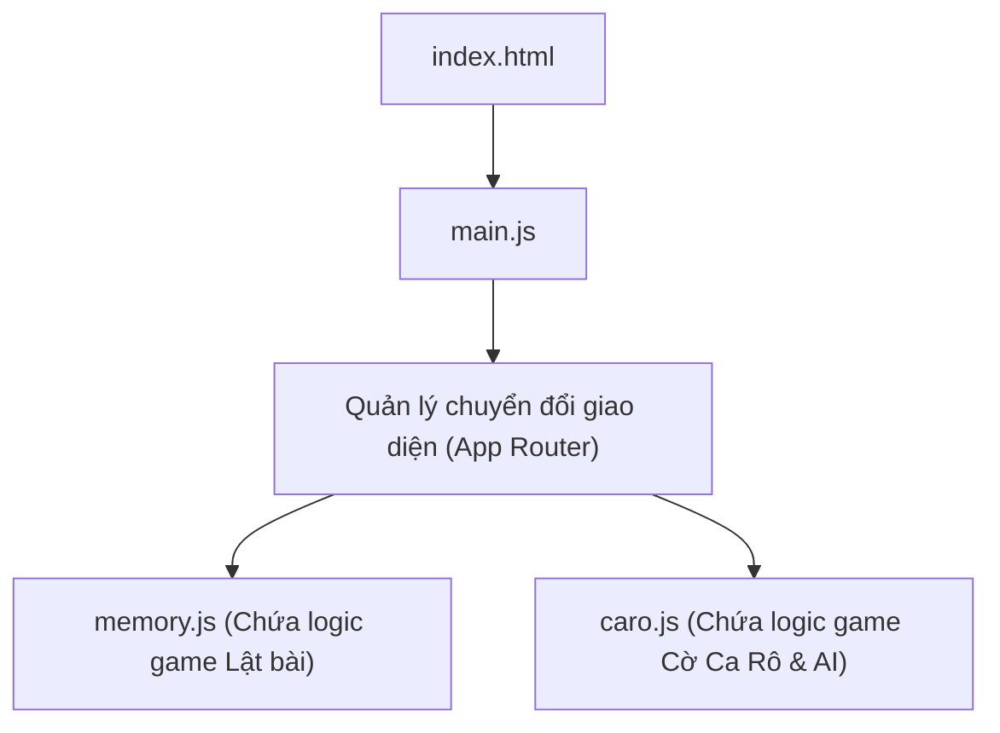

# Kế Hoạch Kỹ Thuật: Thêm Game Cờ Ca Rô (Gomoku) Vào Web Mini-Game

Tài liệu này trình bày kế hoạch chi tiết để phát triển và tích hợp trò chơi **Cờ Ca Rô (Gomoku)** vào giao diện web mini-game hiện tại. Kế hoạch tuân thủ các tiêu chuẩn thiết kế cao cấp, đảm bảo tính thẩm mỹ hiện đại, hiệu ứng mượt mà và hỗ trợ cả chế độ chơi với Máy (AI) và chơi hai người (PvP).

---

## 1. Phân Tích Yêu Cầu & Kiến Trúc Tổng Quan

### 1.1. Hiện trạng dự án
- Ứng dụng hiện tại là game **Memory Match** (Lật thẻ bài trùng khớp) được xây dựng bằng HTML, CSS thuần và Javascript thuần.
- Giao diện có màu chủ đạo là tối (Dark theme với tông màu đỏ/hồng sẫm: `#2a0f12` đến `#4b1b1b`).
- Cấu trúc thư mục gồm các file ở thư mục gốc: `index.html`, `style.css`, `main.js`.

### 1.2. Mục tiêu kỹ thuật
- Tích hợp thêm game **Cờ Ca Rô** mà không phá vỡ cấu trúc và chức năng của game cũ.
- Tái cấu trúc mã nguồn để đảm bảo tính module (tách logic từng game ra các file JS riêng biệt).
- Thiết kế màn hình **Lựa Chọn Game (Game Selection Menu)** đẹp mắt, hiện đại làm điểm nhấn đầu tiên khi truy cập.
- Xây dựng trò chơi Cờ Ca Rô với các tính năng:
  - **Chế độ chơi**: Chơi hai người (Local PvP) hoặc Chơi với Máy (AI PvE).
  - **Cấp độ AI**: Dễ (Easy), Trung bình (Medium), Khó (Hard).
  - **Luật chơi**: Tùy chọn luật Việt Nam truyền thống (5 quân thắng, chặn 2 đầu không thắng) hoặc luật Gomoku chuẩn quốc tế (5 quân thắng bất kể chặn).
  - **Tính năng tiện ích**: Đi lại (Undo), Đếm thời gian (Timer), Đếm số lượt đi (Moves Counter), Reset bàn cờ.
  - **Thiết kế**: Bàn cờ dạng kính mờ (Glassmorphism), các quân cờ X và O có hiệu ứng phát sáng Neon độc đáo.

---

## 2. Kế Hoạch Tái Cấu Trúc Mã Nguồn

Để đảm bảo code sạch và dễ bảo trì, chúng ta sẽ cấu trúc lại các file Javascript như sau:

### Chi tiết các file:
1. **`index.html`**:
   - Thêm phần chọn game chính (`#menu-view`).
   - Bao bọc game Memory hiện tại vào container `#memory-game-view` và thêm nút quay lại menu.
   - Thêm container `#caro-game-view` chứa bàn cờ Ca Rô, bảng điều khiển và thông số.
   - Import các file js theo thứ tự: `memory.js`, `caro.js`, và `main.js` (hoặc cấu trúc module).
2. **`style.css`**:
   - Giữ nguyên các biến CSS cốt lõi, bổ sung các biến phục vụ game Ca Rô (màu quân X, màu quân O, hiệu ứng phát sáng).
   - Thêm CSS cho màn hình Menu chọn game.
   - Thêm CSS cho Bàn cờ Ca Rô hỗ trợ responsive (tự động co giãn theo kích thước màn hình).
3. **`memory.js` (Tạo mới)**: Di chuyển toàn bộ code game Memory hiện tại từ `main.js` sang đây và đóng gói thành một lớp hoặc tập hợp hàm có thể khởi tạo lại.
4. **`caro.js` (Tạo mới)**: Viết toàn bộ logic bàn cờ Ca Rô, kiểm tra thắng thua, tính năng đi lại (Undo) và thuật toán AI.
5. **`main.js` (Cập nhật)**: Đóng vai trò là file điều phối chính (Router) để ẩn/hiện các view khi người chơi chọn game.

---

## 3. Thiết Kế Giao Diện & Trải Nghiệm Người Dùng (UI/UX)

> [!IMPORTANT]
> Giao diện phải mang lại cảm giác cao cấp (Premium) bằng cách tận dụng hiệu ứng Glassmorphism, đổ bóng mờ, phát sáng Neon và các vi tương tác (micro-interactions).

### 3.1. Giao diện Chọn Game (Game Selection Menu)
- Thiết kế hai thẻ lớn (Game Cards) nằm ngang hoặc dọc tùy màn hình.
- Thẻ có hình ảnh minh họa nhỏ, tiêu đề game, mô tả ngắn gọn và nút "Chơi ngay" rực rỡ.
- Hiệu ứng di chuột (Hover effect): Thẻ hơi nổi lên, phát sáng viền nhẹ, phóng to nhẹ hình ảnh bên trong.

### 3.2. Giao diện Cờ Ca Rô
- **Bàn cờ (Board)**: 
  - Kích thước lưới: **$12 \times 12$ hoặc $15 \times 15$** (Đề xuất $12 \times 12$ hoặc $14 \times 14$ để cân bằng giữa độ rộng bàn cờ và khả năng hiển thị tốt trên thiết bị di động).
  - Từng ô cờ có viền mỏng bán trong suốt (`rgba(255, 255, 255, 0.05)`).
- **Quân cờ**:
  - **Quân X**: Thiết kế dạng chữ X neon màu xanh ngọc (Cyan / `#06b6d4`), đổ bóng phát sáng (`box-shadow` hoặc SVG filter).
  - **Quân O**: Thiết kế dạng vòng tròn neon màu hồng đào/đỏ hồng (`#f43f5e`), đồng bộ tông màu chính của web.
  - Khi hover lên ô trống, hiển thị mờ quân cờ hiện tại của người chơi để gợi ý vị trí đặt cờ.
- **Bảng điều khiển**:
  - Gồm nút: "Quay lại Menu", "Đi lại (Undo)", "Chơi lại (Restart)".
  - Chế độ chọn: "Chơi với Máy" hoặc "Chơi 2 Người".
  - Chọn độ khó AI: "Dễ", "Trung bình", "Khó".
  - Chọn luật chơi: "Luật tự do" hoặc "Chặn 2 đầu".
- **Hiệu ứng thắng cuộc**:
  - Khi có người thắng, 5 quân cờ thẳng hàng sẽ nhấp nháy phát sáng cực mạnh.
  - Vẽ một đường nối phát sáng chạy dọc qua tâm 5 quân cờ thắng cuộc.

---

## 4. Giải Thuật Chi Tiết Cho Game Cờ Ca Rô

### 4.1. Thuật toán kiểm tra thắng thua (Win Checker)
Khi một quân cờ được đặt tại vị trí `(row, col)`, ta chỉ cần kiểm tra xem có chuỗi 5 quân liên tiếp cùng màu đi qua vị trí này theo 4 hướng hay không:
1. **Ngang**: Kiểm tra từ `(row, col - 4)` đến `(row, col + 4)`.
2. **Dọc**: Kiểm tra từ `(row - 4, col)` đến `(row + 4, col)`.
3. **Chéo chính (Xuống phải)**: Kiểm tra từ `(row - 4, col - 4)` đến `(row + 4, col + 4)`.
4. **Chéo phụ (Lên phải)**: Kiểm tra từ `(row + 4, col - 4)` đến `(row - 4, col + 4)`.

**Luật Chặn Hai Đầu (Vietnamese Traditional Rule)**:
- Trong khi đếm chuỗi 5 quân cờ liên tiếp, nếu hai đầu của chuỗi bị chặn bởi quân của đối thủ (hoặc mép bàn cờ nếu áp dụng luật chặn mép), chuỗi đó không được tính là chiến thắng. Điều này giúp tăng tính chiến thuật cho trò chơi.
- Chúng ta sẽ cung cấp nút cấu hình bật/tắt luật này trong cài đặt.

### 4.2. Thuật toán Trí Tuệ Nhân Tạo (AI Engine - PvE)
Vì bàn cờ Ca Rô có kích thước lớn ($12 \times 12$ trở lên), giải thuật tìm kiếm sâu như Minimax đầy đủ sẽ bị bùng nổ tổ hợp và chạy rất chậm trên JS trình duyệt. Thay vào đó, ta sử dụng phương pháp **Đánh giá điểm theo mẫu hình (Heuristic Pattern Evaluation)** rất hiệu quả:

#### Ý tưởng thuật toán:
1. Mỗi ô trống trên bàn cờ sẽ được tính điểm dựa trên mức độ quan trọng đối với cả AI (để tấn công) và Người chơi (để phòng thủ).
2. Điểm của một ô trống = **Điểm Tấn Công (AI cố gắng tạo thế)** + **Điểm Phòng Thủ (AI ngăn chặn người chơi tạo thế)**.
3. AI sẽ chọn ô trống có tổng điểm cao nhất để đi.

#### Bảng điểm Heuristic (Tham khảo):
| Thế cờ (Pattern) | Mô tả thế cờ | Điểm Tấn Công (AI) | Điểm Phòng Thủ (Đỡ) |
|---|---|---|---|
| **5 quân liên tiếp** | Thắng cuộc | 100,000 | 80,000 |
| **Bốn quân mở (Open 4)** | 4 quân, hai đầu trống | 10,000 | 8,000 |
| **Bốn quân bị chặn (Blocked 4)** | 4 quân, một đầu trống, một đầu bị chặn | 1,500 | 1,200 |
| **Ba quân mở (Open 3)** | 3 quân, hai đầu trống | 1,200 | 1,000 |
| **Ba quân bị chặn (Blocked 3)** | 3 quân, một đầu bị chặn | 400 | 300 |
| **Hai quân mở (Open 2)** | 2 quân, hai đầu trống | 300 | 200 |

*Điểm tấn công của AI luôn cao hơn điểm phòng thủ một chút để AI ưu tiên cơ hội tự thắng hơn là chỉ đi theo chặn đối thủ.*

#### Cấp độ khó:
- **Dễ (Easy)**: AI chọn ngẫu nhiên một trong các ô xung quanh các quân cờ đã hạ, hoặc đánh giá nông (chỉ chọn nước đi ăn ngay hoặc chặn 3 quân đơn giản).
- **Trung bình (Medium)**: AI tính toán điểm Heuristic cho tất cả ô trống trực tiếp lân cận và đi nước tốt nhất.
- **Khó (Hard)**: AI kết hợp tính toán Heuristic nâng cao, phân tích thêm 1 bước tiếp theo (nếu đi vào ô này, đối thủ có những phản ứng gì) để tránh bẫy "Double 3" (hai đường 3 đồng thời) hoặc "Double 4".

---

## 5. Kế Hoạch Triển Khai (Step-by-Step Task List)

Dưới đây là các bước thực hiện chi tiết cho chuỗi quy trình Coder -> Reviewer -> QA:

### Bước 1: Chuẩn bị & Tách File (File Preparation)
- Di chuyển logic game cũ trong `main.js` sang `memory.js`.
- Cấu trúc lại `memory.js` thành một Module hoặc Class (`class MemoryMatch`) có các phương thức công khai như `init()`, `destroy()`, và các sự kiện kết thúc game.
- Cập nhật `index.html` để nạp thêm các script mới.

### Bước 2: Thiết Kế Layout Menu & Giao Diện Mới (HTML & CSS)
- Cập nhật `index.html` để thêm màn hình Chọn Game (`#menu-view`) và Giao diện game Caro (`#caro-game-view`).
- Cập nhật `style.css`:
  - Viết style cho menu chọn game bóng bẩy.
  - Thiết kế CSS Grid cho bàn cờ Caro, các ô cờ co giãn mượt mà bằng đơn vị `vmin` hoặc `vmax`.
  - Tạo kiểu dáng quân X và O bằng SVG hoặc CSS thuần với hiệu ứng phát sáng neon gradient.
  - Viết các hiệu ứng chuyển cảnh mượt mà giữa các màn hình.

### Bước 3: Phát Triển Logic Game Caro Cơ Bản (Core Game Play)
- Viết file `caro.js`. Khởi tạo lớp `class CaroGame`.
- Xây dựng mảng hai chiều biểu diễn bàn cờ.
- Lắng nghe sự kiện click trên ô bàn cờ để đặt quân X hoặc O (chế độ PvP cục bộ trước).
- Viết bộ lọc/kiểm tra 5 quân liên tiếp thắng cuộc (Win Checker), hỗ trợ cả luật tự do và luật chặn hai đầu Việt Nam.
- Thiết lập tính năng **Undo** (sử dụng một mảng lưu lịch sử các bước đi `moveHistory`).
- Thiết lập bộ đếm thời gian và đếm nước đi.

### Bước 4: Phát Triển Thuật Toán AI (AI Engine Implementation)
- Viết hàm chấm điểm Heuristic cho một vị trí ô cờ dựa trên các cấu hình quân cờ xung quanh nó.
- Tích hợp lượt đi của AI vào luồng chơi khi người dùng chọn chế độ PvE.
- Cài đặt 3 mức độ khó bằng cách điều chỉnh các hệ số trọng số và tầm nhìn phân tích của AI.

### Bước 5: Kiểm Thử & Tối Ưu (QA & Optimization)
- Kiểm tra tính responsive trên thiết bị di động: Đảm bảo bàn cờ không bị tràn màn hình, các ô cờ đủ to để ngón tay dễ dàng chạm vào.
- Chạy thử nghiệm các trường hợp thắng chéo, thắng dọc, thắng ngang, luật chặn hai đầu xem hệ thống nhận diện có chính xác không.
- Đo hiệu năng AI: Đảm bảo thời gian tính toán nước đi của AI ở chế độ "Khó" dưới 200ms để không gây trễ giao diện.
- Tối ưu hóa UI: Thêm hiệu ứng âm thanh click nhẹ (nếu cần/tùy chọn) và các hiệu ứng nổ nhẹ khi thắng.

---

## 6. Kế Hoạch Đánh Giá & Nghiệm Thu (Definition of Done)

Trò chơi được coi là hoàn thành khi đạt đủ các tiêu chí:
1. **Hoạt động ổn định**: Không có lỗi JS trong Console. Cả hai game hoạt động hoàn hảo khi chuyển đổi qua lại.
2. **Đáp ứng thẩm mỹ (Beautiful Design)**: Giao diện tối mượt mà, đồng bộ phong cách, các quân cờ phát sáng đẹp mắt. Giao diện menu chọn game chuyển động mượt.
3. **Đáp ứng thiết bị di động (Responsive)**: Chơi tốt trên iPhone, iPad lẫn Desktop lớn.
4. **Logic chính xác**: Phát hiện thắng/thua chuẩn xác theo luật cấu hình. AI đưa ra nước đi thông minh ở cấp độ Khó.
5. **Cập nhật tài liệu**: Tài liệu `memory.md` được cập nhật đầy đủ để ghi lại cấu trúc mới của mã nguồn.
