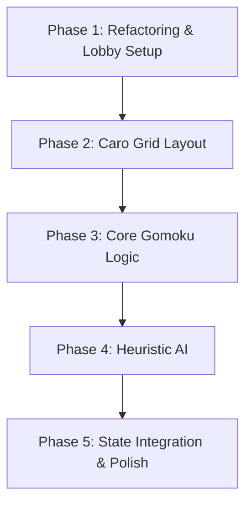

# Technical Architecture Plan: Gomoku (Cờ Caro) Game Integration

This document defines the integration plan, architectural changes, and design specifications for adding **Gomoku (Cờ Caro 15x15)** to the browser-based mini-game collection. The project will be refactored into a Multi-Game Lobby system with a premium, responsive glassmorphism interface.

---

## 1. System Architecture & Tech Stack

Following the established framework-free Single Page Application (SPA) architecture, the multi-game system will be structured as follows:
- **UI Structure**: The app will be divided into modular views using `<section>` elements in `index.html`, switched dynamically via JavaScript:
  - `#lobby-view`: The landing dashboard listing all available games with stats.
  - `#memory-view`: The existing Memory Match game.
  - `#caro-view`: The new Gomoku (Cờ Caro) game.
- **Styling**: Vanilla CSS, using custom properties and glassmorphism styling in `style.css`.
  - Memory Match theme: Rose accent (`--accent-rose: #fb7185`).
  - Caro theme: Emerald/Cyan neon accents (`--accent-emerald: #10b981`, `--accent-cyan: #06b6d4`, `--accent-coral: #ff7f50`).
- **Game Logic**:
  - `main.js`: Core coordinator, state router, global notification system, and profile manager (`localStorage` persistence).
  - `js/games/memory.js`: Memory match game logic separated from the central lobby.
  - `js/games/caro.js`: Gomoku game loop, 15x15 board generator, PvP/PvE controller, win-check/draw-check, and heuristic AI.

---

## 2. Design System & Aesthetics (Teal/Cyan/Coral Caro Theme)

The Gomoku game will feature a **Cyberpunk Neon & Holographic Grid** theme to contrast with the Memory Match Rose theme:

| Color Token | Value | Visual Purpose |
|---|---|---|
| `--accent-emerald` | `#10b981` | Theme colors, borders, titles, success badges |
| `--accent-cyan` | `#06b6d4` | Player X stones, active indicators, neon glow |
| `--accent-coral` | `#ff7f50` | Player O stones, opponent neon glow |
| `--board-line` | `rgba(255, 255, 255, 0.08)` | Grid lines for the 15x15 board |

### Component Design Specifications
- **Game Lobby Cards**: Glass cards in the lobby with hover scale transformations, neon border highlights, description text, and game-specific stats.
- **Caro Board**: 15x15 grid layout using CSS Grid or HTML Canvas. CSS Grid is preferred for modular DOM event handling. The board will scale responsively to fit mobile viewports.
- **Star Points (Điểm Thiên Nguyên)**: Standard Gomoku coordinate dots at `(3,3), (3,11), (7,7), (11,3), (11,11)` (0-indexed) to match official boards.
- **Stone Styling**:
  - **Stone X**: Cyan glowing symbol (`#06b6d4`) dropping with a scale transition.
  - **Stone O**: Coral glowing symbol (`#ff7f50`) dropping with a scale transition.
- **Winning Line Animation**: The 5 winning stones pulse dynamically with a gold/cyan neon glow background (`@keyframes winning-pulse`).

---

## 3. Project Directory Structure

The files will be updated/created as follows:

```text
wt-cc212f6c1ce64bb493c6959ac8bffb80/
├── index.html                   # Multi-view SPA structure (lobby, memory, caro)
├── style.css                    # Shared CSS, lobby cards, memory match, and Caro 15x15 board layout
├── main.js                      # Central coordinator, ProfileManager, GameHub namespace, and routing
└── js/
    └── games/
        ├── memory.js            # Separation of the Memory Match game engine
        └── caro.js              # NEW FILE: Gomoku (Cờ Caro) 15x15 logic, checkWin, and Heuristic AI
```

---

## 4. File-by-File Technical Specifications

### A. [index.html](file:///D:/workspace/wt-cc212f6c1ce64bb493c6959ac8bffb80/index.html)
1. **Lobby Dashboard (`#lobby-view`)**:
   - Header with a premium glowing title: `"MINI GAME SUITE"`.
   - Grid layout of game cards:
     - **Memory Match Card**: Shows highest level reached, best time, and a "Play Now" button.
     - **Cờ Caro Card**: Shows Win/Loss/Draw record and a "Play Now" button.
2. **Memory Match View (`#memory-view`)**:
   - Wrap the existing memory match layout inside a `<section id="memory-view" class="view-section hidden">`.
   - Add a `<button class="back-btn btn">Back to Lobby</button>` in the header.
3. **Cờ Caro View (`#caro-view`)**:
   - Add a `<section id="caro-view" class="view-section hidden">` containing:
     - Header: Back to lobby button, title, and current turn indicator (`id="caro-turn-display"`).
     - Game controls panel: Game Mode selection (PvP vs PvE), Symbol choice (X or O), Reset Button, Undo Button.
     - Board container: `<div class="caro-board" id="caro-board"></div>` (15x15 layout, cells injected dynamically by JS).
4. **Script Imports**:
   - Load scripts at the bottom:
     ```html
     <script src="main.js"></script>
     <script src="js/games/memory.js"></script>
     <script src="js/games/caro.js"></script>
     ```

### B. [style.css](file:///D:/workspace/wt-cc212f6c1ce64bb493c6959ac8bffb80/style.css)
1. **View Sections**:
   - `.view-section`: Core viewport layout, centering container.
   - `.hidden`: `display: none !important;` used by the SPA router.
2. **Lobby Styling**:
   - Grid layout for lobby cards, using standard styling with subtle micro-animations (scale, neon shadow borders).
3. **Caro Board & Grid Cells**:
   - `.caro-board`: 15x15 CSS Grid. Maximum width of `520px` (or `95vw` on mobile to prevent overflow). Gap of `1px` or thin grid borders.
   - `.caro-cell`: Aspect ratio `1/1`, relative positioning, cursor pointer, light glass background.
   - `.caro-cell.star-point::after`: Adds a small centered dot inside Gomoku star point coordinates.
   - `.caro-cell::before` / `.caro-cell::after`: Renders ghost previews of `X` or `O` on hover:
     - Uses board CSS variables: `--hover-symbol` and `--hover-color` set dynamically via JS.
4. **Stones Styling**:
   - `.stone-x`, `.stone-o`: Large, bold letters (`X` / `O`) with glowing text-shadow (cyan glow for X, coral glow for O).
   - `.winning-cell`: Triggers a pulse animation changing background and adding neon glow box-shadow.

### C. [main.js](file:///D:/workspace/wt-cc212f6c1ce64bb493c6959ac8bffb80/main.js)
1. **Global Namespace (`window.GameHub`)**:
   - Define a global coordinator offering:
     - `GameHub.showView(viewId)`: Toggles active views with class toggling.
     - `GameHub.profile`: Saves and loads stats to/from `localStorage`.
       - Stats schema:
         ```javascript
         {
           memoryLevel: 1,
           caroWins: 0,
           caroLosses: 0,
           caroDraws: 0
         }
         ```
       - Method `recordGame(gameId, won, stats)`: Updates relevant profile counters and saves.
     - `GameHub.showNotification(msg, type)`: Toast notifications.
     - `GameHub.showModal(config)`: Displays victory or failure modals.
2. **Router Setup**:
   - Connect all "Play Now" and "Back to Lobby" buttons to `GameHub.showView()`.

### D. [js/games/caro.js](file:///D:/workspace/wt-cc212f6c1ce64bb493c6959ac8bffb80/js/games/caro.js) (New File)
A single-instance module `window.CaroGame` which manages game state and AI calculations:
1. **Game State**:
   - `board`: 15x15 2D array, initialized to `null`.
   - `activeTurn`: `'X'` or `'O'`.
   - `playMode`: `'pvp'` or `'pve'`.
   - `humanSymbol`: `'X'` (default).
   - `aiSymbol`: `'O'`.
   - `history`: Stack containing board snapshots (or move logs) to support undo.
   - `winState`: Boolean indicating if game has ended.
   - `aiThinking`: Boolean blocking player moves while AI is processing.
   - `initialized`: Boolean for controller status.
2. **Controller Logic**:
   - `init()`: Binds settings (mode select, symbol select, reset, undo buttons) and event listeners.
   - `reset()`: Wipes board, clears history, updates turn display, resets AI thinking, and draws empty grid DOM.
   - `handleCellClick(r, c)`:
     - Validates move. If legal, drops stone, checks win/draw.
     - If game continues and `playMode === 'pve'`, schedules AI move with a `300ms` thinking latency to avoid instant moves.
3. **Win-Check Algorithm (`checkWin(r, c)`)**:
   - For a placed stone at `(r, c)`:
     - Scan in 4 directions: Horizontal, Vertical, Diagonal Down-Right, Diagonal Up-Right.
     - Count contiguous stones of the same symbol. If count $\ge 5$, return `{ symbol: activeTurn, stones: [...] }` containing coordinates.
4. **Heuristic AI Engine (`calculateAiMove()`)**:
   - Scan all empty board cells and compute an heuristic score for each.
   - For cell `(r, c)`, evaluate all 5-cell sequences containing `(r, c)` in all 4 directions.
   - **Scoring Patterns (Example)**:
     - 4 AI stones, 0 Player stones: $+50,000$ points (Immediate win)
     - 4 Player stones, 0 AI stones: $+20,000$ points (Urgent block)
     - 3 AI stones, 0 Player stones: $+1,000$ points (Threat creation)
     - 3 Player stones, 0 AI stones: $+500$ points (Threat blocking)
     - 2 AI stones, 0 Player stones: $+100$ points
     - 2 Player stones, 0 AI stones: $+50$ points
     - 1 AI stone, 0 Player stones: $+10$ points
     - 1 Player stone, 0 AI stones: $+5$ points
   - Sum scores across all sequences. AI plays the cell with the highest aggregated score.
5. **Undo Logic**:
   - In PvP: Reverts exactly 1 move from the history stack and toggles the turn.
   - In PvE: Reverts exactly 2 moves (AI move + Player move) from history to return the turn to the human.

---

## 5. Development Checklist & Implementation Phases



### Phase 1: Refactoring & Lobby Setup
- [ ] Migrate current Memory Match logic from `main.js` to `js/games/memory.js`.
- [ ] Implement central view router, notification system, and `localStorage` profile manager in `main.js`.
- [ ] Restructure `index.html` with `#lobby-view`, `#memory-view`, `#caro-view` sections.
- [ ] Add navigation buttons and game selector cards.

### Phase 2: Caro Grid Layout & Aesthetics
- [ ] Add styling for the 15x15 Grid in `style.css` with responsive adjustments (`max-width: 95vw`).
- [ ] Add Gomoku star points layout matching standard coordinates.
- [ ] Add neon symbol colors (cyan for X, coral for O) and grid border styles.
- [ ] Set up JS board generator to dynamically append `.caro-cell` nodes.
- [ ] Implement dynamic board-level CSS variables (`--hover-symbol`, `--hover-color`) to support turn-aware ghost hover symbols.

### Phase 3: Core Gomoku Game Loop (Local PvP)
- [ ] Implement state variables, undo history stack, and reset functions in `js/games/caro.js`.
- [ ] Code the 4-direction checkWin logic scanning for 5-in-a-row.
- [ ] Hook up local PvP play: alternating turns, placing stones on click, and blocking taken cells.
- [ ] Implement victory alerts/modals and record results.

### Phase 4: Smart Heuristic AI (PvE)
- [ ] Implement the heuristic-based board scoring loop in `calculateAiMove()`.
- [ ] Integrate PvE game mode loop: human move $\rightarrow$ AI thinking delay ($300$ms) $\rightarrow$ AI move.
- [ ] Verify AI blocks open 3s and 4s, and takes immediate wins.
- [ ] Implement double-move undo logic for PvE.

### Phase 5: Final QA & Polish
- [ ] Test layout responsiveness on various mobile screen simulator widths.
- [ ] Ensure `localStorage` state persists correctly and statistics update in the lobby in real time.
- [ ] Validate that the unit test runner (`test_caro_logic.js`) successfully passes.

---

## 6. Verification and Test Scenarios

1. **Unit Test Verification**: Run `test_caro_logic.js` using node to verify that initialization, coordinates, checkWin, heuristic AI block logic, and undo stacks operate according to specifications.
2. **SPA Router Navigation**: Tapping game card launch buttons or clicking "Back to Lobby" smoothly hides non-active screens and displays the target view.
3. **Turn & Symbol Switching**: Choosing to play as 'O' correctly prompts the AI (playing 'X') to take the first turn.
4. **AI Defense & Offense**: Set up human 3-in-a-row or 4-in-a-row threats to verify that the AI blocks them appropriately.
5. **Undo Action**: Confirm PvP rolls back 1 move, and PvE rolls back 2 moves seamlessly.
