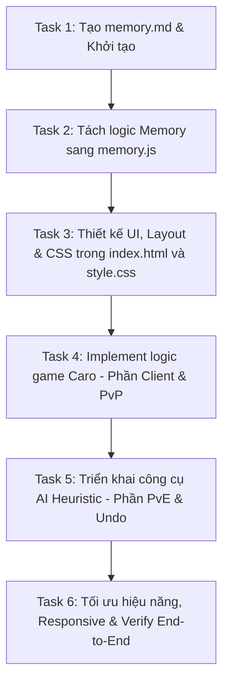

# Kế hoạch kỹ thuật: Tích hợp game Cờ Ca Rô (Gomoku) vào Web Mini Game

Tài liệu này trình bày kế hoạch kiến trúc để thêm game Cờ Ca Rô (Gomoku 15x15) vào trang web hiện tại (đang có game Memory Match), đảm bảo giữ nguyên tính thẩm mỹ cao (premium, glassmorphic) và hiệu năng mượt mà.

---

## Mục tiêu & phạm vi

*   **Mục tiêu:** Tích hợp thêm game Cờ Ca Rô vào ứng dụng web hiện tại, tạo giao diện chuyển đổi mượt mà giữa hai game.
*   **Phạm vi chức năng:**
    1.  **Hệ thống chuyển đổi game (Game Navigation/Selector):** Menu dạng tab glassmorphic để người dùng chọn chơi Memory Match hoặc Cờ Ca Rô.
    2.  **Giao diện game Cờ Ca Rô:**
        *   Bàn cờ kích thước 15x15 chuẩn Gomoku.
        *   Thiết kế responsive tự động co giãn theo kích thước màn hình (đặc biệt là mobile).
        *   Hiệu ứng hiển thị quân cờ X (neon đỏ/hồng) và O (neon xanh cyan) có glow đẹp mắt.
        *   Highlight ô cờ vừa đánh (nước đi cuối cùng) để dễ theo dõi.
        *   Highlight 5 quân cờ chiến thắng khi kết thúc trận đấu.
    3.  **Chế độ chơi:**
        *   **Người vs Người (PvP):** Chơi hai người trên cùng một thiết bị.
        *   **Người vs Máy (PvE):** Chơi với AI sử dụng thuật toán heuristic thông minh, phản hồi tức thì.
    4.  **Tính năng bổ trợ:**
        *   **Undo (Hoàn nước đi):** Cho phép rút lại nước đi trước đó (đặc biệt hữu ích khi chơi với AI).
        *   **Restart Game:** Reset bàn cờ và chơi lại từ đầu.
        *   **Bộ đếm thời gian & Lượt đi:** Hiển thị thông tin trực quan.

---

## Phương án

### 1. Phương án Quản lý Mã nguồn (Code Separation)
*   **Khuyến nghị (Chọn):** Chia nhỏ logic thành các file độc lập: `memory.js` (logic game Memory Match), `caro.js` (logic game Caro + AI), và `main.js` (bộ điều phối chuyển tab và khởi tạo). Do chạy trên trình duyệt có thể qua giao thức `file://` (không có server), chúng ta sẽ **không sử dụng ES Modules** (`type="module"`) nhằm tránh lỗi CORS, mà thay vào đó sử dụng mô hình đóng gói Namespace Object (ví dụ: `const MemoryGame = { ... }`, `const CaroGame = { ... }`).
*   **Phương án loại bỏ:**
    *   *Viết gộp tất cả vào `main.js`*: Code sẽ rất dài (lên tới 500-700 dòng), khó bảo trì và dễ xảy ra xung đột biến toàn cục (ví dụ bộ đếm thời gian, lượt đi).
    *   *Sử dụng ES Modules (import/export)*: Có thể gây lỗi CORS khi người dùng chạy trực tiếp file HTML từ máy tính cá nhân bằng cách click đúp.

### 2. Phương án Bố cục & Giao diện (Layout UI)
*   **Khuyến nghị (Chọn):** Sử dụng thiết kế Glassmorphism đồng bộ với theme tối hiện tại của trang web:
    *   Khung bàn cờ Caro 15x15 được dựng bằng CSS Grid.
    *   Mỗi ô cờ có đường viền mờ (`rgba`), hiệu ứng hover hiển thị mờ quân cờ sắp đánh của lượt hiện tại.
    *   Quân cờ sử dụng font chữ lớn kết hợp hiệu ứng neon phát sáng (text-shadow glow).
    *   Sử dụng CSS scale hoặc đơn vị `vmin` để bàn cờ tự động thu nhỏ vừa khít trên màn hình điện thoại di động mà không bị tràn (overflow).
*   **Phương án loại bỏ:** Sử dụng canvas để vẽ bàn cờ: Khó tạo các hiệu ứng CSS hover đẹp mắt, khó responsive và tốn nhiều code xử lý sự kiện click tọa độ phức tạp hơn so với DOM thông thường.

### 3. Thuật toán AI cho Cờ Ca Rô
*   **Khuyến nghị (Chọn):** Thuật toán Heuristic quét điểm lân cận.
    *   AI sẽ đánh giá tất cả các ô trống lân cận (trong phạm vi 1-2 ô xung quanh các quân cờ đã đánh) bằng cách chấm điểm cho cả hai hướng: **Tấn công** (tạo chuỗi quân của AI) và **Phòng thủ** (chặn chuỗi quân của người chơi).
    *   Các mẫu hình (pattern) được gán điểm số lũy tiến (Ví dụ: 5 quân = 100,000; Open 4 = 10,000; Blocked 4 hoặc Open 3 = 1,000; Open 2 = 100...).
    *   Phương pháp này tính toán cực nhanh (< 5ms), chạy trực tiếp trên luồng chính của trình duyệt mà không gây lag và đem lại trải nghiệm chơi thông minh.
*   **Phương án loại bỏ:** Minimax với Alpha-Beta Pruning độ sâu lớn: Bàn cờ 15x15 có nhánh quá rộng (lên tới 225), việc duyệt cây game đầy đủ sẽ gây đơ trình duyệt nếu không sử dụng Web Workers phức tạp.

---

## Thiết kế kỹ thuật

### 1. Cấu trúc thư mục dự kiến
```text
/workspace
  ├── AGENTS.md (Đã có - chứa conventions)
  ├── memory.md (Sẽ tạo mới - lưu giữ context phát triển)
  ├── architect_plan.md (File này - kế hoạch kiến trúc)
  ├── index.html (Sẽ chỉnh sửa - cấu trúc HTML đa game)
  ├── style.css (Sẽ chỉnh sửa - CSS layout Caro + Switcher)
  ├── main.js (Sẽ chỉnh sửa - Router/Switcher điều hướng)
  ├── memory.js (Sẽ tạo mới - di chuyển logic Memory Match sang)
  └── caro.js (Sẽ tạo mới - toàn bộ logic Caro & AI)
```

### 2. Các thay đổi trong index.html
*   Thêm thanh điều hướng dạng tab:
    ```html
    <nav class="game-nav">
        <button id="nav-memory-btn" class="nav-btn active">Memory Match</button>
        <button id="nav-caro-btn" class="nav-btn">Cờ Ca Rô</button>
    </nav>
    ```
*   Bao bọc game Memory Match cũ trong `<section id="memory-game" class="game-section active">`.
*   Tạo section mới cho Caro: `<section id="caro-game" class="game-section">`.
    *   Gồm tiêu đề, bảng thống kê (Lượt đi, Thời gian), nút điều khiển (Restart, Undo, Chọn chế độ Người/Máy).
    *   Thẻ chứa bàn cờ: `<div id="caro-board" class="caro-board"></div>`.
*   Load các file script theo thứ tự:
    ```html
    <script src="memory.js"></script>
    <script src="caro.js"></script>
    <script src="main.js"></script>
    ```

### 3. Thiết kế CSS trong style.css
*   **Game Switcher Layout:**
    *   `.game-nav`: Căn giữa, bo góc, nền `rgba` trong suốt, mờ đục (backdrop-filter blur).
    *   `.nav-btn`: Hover chuyển màu mịn, khi active sẽ có màu gradient hồng rose/đỏ.
    *   `.game-section`: Mặc định `display: none`. Khi có class `.active` sẽ chuyển thành `display: flex`.
*   **Bàn cờ Caro:**
    *   `.caro-board`: `display: grid; grid-template-columns: repeat(15, 1fr); gap: 1px; background: rgba(255,255,255,0.05);`
    *   `.caro-cell`: Ô cờ tỉ lệ 1:1, nền kính mờ.
    *   `.caro-cell.x`: Quân X neon hồng (`text-shadow: 0 0 10px #f43f5e`).
    *   `.caro-cell.o`: Quân O neon cyan (`text-shadow: 0 0 10px #06b6d4`).
    *   `.caro-cell.last-move`: Viền ngoài nhấp nháy (pulsing border) hoặc shadow đặc trưng.
    *   `.caro-cell.win-highlight`: Đổi nền thành màu success xanh lá và hiệu ứng scale nhỏ.

### 4. Thiết kế Javascript
*   `MemoryGame` (trong `memory.js`):
    *   Chứa toàn bộ mã nguồn hiện tại của game Memory Match.
    *   Cung cấp các hàm: `init()`, `reset()`, `pauseTimer()`, `resumeTimer()`.
*   `CaroGame` (trong `caro.js`):
    *   `board`: Mảng 2 chiều 15x15 chứa trạng thái (0: trống, 1: X, 2: O).
    *   `history`: Mảng lưu danh sách tọa độ các nước đi để phục vụ `Undo`.
    *   `gameMode`: `'pvp'` hoặc `'pve'`.
    *   `currentPlayer`: `1` (X) hoặc `2` (O).
    *   `checkWin(row, col)`: Duyệt 4 hướng từ ô vừa đánh để phát hiện chuỗi liên tiếp 5 quân cùng loại.
    *   `makeMove(row, col)`: Thực hiện đánh cờ, cập nhật UI, kiểm tra thắng/thua, đổi lượt. Nếu là PvE và tới lượt AI, gọi hàm tính toán nước đi của AI.
    *   `getBestMoveAI()`: Thuật toán heuristic đánh giá điểm của AI.
    *   `undo()`: Rút lại nước đi. Nếu PvE, undo 2 nước đi liên tiếp.
*   `main.js` (Điều hướng):
    *   Lắng nghe click trên `.game-nav` để ẩn/hiện section tương ứng.
    *   Khi ẩn game này, tạm dừng timer của game đó và kích hoạt game kia.

---

## Hạng mục công việc

Các hạng mục công việc được thiết lập tuần tự, có sự phụ thuộc rõ ràng để đảm bảo tính an toàn cho codebase:



### Chi tiết các Task:

1.  **Task 1: Tạo memory.md & Khởi tạo dự án**
    *   *Mục tiêu:* Thiết lập bộ nhớ lưu trữ bối cảnh của dự án theo đúng convention.
    *   *Chi tiết:* Tạo file [memory.md](file:///D:/workspace/wt-661a08b9b90e4e33b5423ce05b00ca7c/memory.md) ghi nhận kiến trúc hiện tại, các files sẽ chỉnh sửa, và lưu ý phát triển.
    *   *Dependency:* Không.

2.  **Task 2: Tách logic Memory Match sang memory.js**
    *   *Mục tiêu:* Phân rã mã nguồn hiện tại của Memory Match ra khỏi file điều phối chính.
    *   *Chi tiết:* Di chuyển toàn bộ code game cũ từ `main.js` sang `memory.js`, đóng gói trong đối tượng toàn cục `MemoryGame`. Sửa đổi `main.js` để chỉ thực hiện gọi khởi động `MemoryGame.init()`. Chạy thử ứng dụng để kiểm tra không bị lỗi hồi quy (regression test).
    *   *Dependency:* Task 1.

3.  **Task 3: Thiết kế UI, Layout & CSS trong index.html và style.css**
    *   *Mục tiêu:* Dựng giao diện người dùng chuyển game và bàn cờ Caro.
    *   *Chi tiết:* Thêm các thẻ HTML cho thanh điều hướng và khung game Caro. Thêm style CSS cho thanh điều hướng, khung bàn cờ 15x15, các ô cờ, quân X, quân O và các hiệu ứng phát sáng. Cài đặt responsive để bàn cờ tự co giãn mượt mà.
    *   *Dependency:* Task 2.

4.  **Task 4: Implement logic game Caro - Phần Client & PvP**
    *   *Mục tiêu:* Xây dựng tính năng chơi Caro cơ bản giữa hai người (PvP).
    *   *Chi tiết:* Khởi tạo cấu trúc dữ liệu bàn cờ trong `caro.js`. Xử lý sự kiện click ô cờ để thay đổi trạng thái, cập nhật UI quân X/O tương ứng. Xây dựng hàm kiểm tra thắng thua (5 quân thẳng hàng).
    *   *Dependency:* Task 3.

5.  **Task 5: Triển khai công cụ AI Heuristic - Phần PvE & Undo**
    *   *Mục tiêu:* Tích hợp trí tuệ nhân tạo và tính năng quay lui nước đi.
    *   *Chi tiết:* Lập trình thuật toán Heuristic tính điểm cho AI (chặn và công 4 hướng). Tích hợp chế độ chơi Người vs Máy. Xử lý logic nút "Undo" (lùi 2 nước ở chế độ PvE và 1 nước ở PvP).
    *   *Dependency:* Task 4.

6.  **Task 6: Tối ưu hiệu năng, Responsive & Verify End-to-End**
    *   *Mục tiêu:* Hoàn thiện sản phẩm, đảm bảo không có lỗi hiển thị và cập nhật tài liệu.
    *   *Chi tiết:* Tối ưu hóa lại thuật toán AI, sửa các lỗi CSS tràn viền trên thiết bị di động nhỏ. Tiến hành chơi thử và verify toàn bộ tính năng. Cập nhật trạng thái hoàn thành vào `memory.md`.
    *   *Dependency:* Task 5.

---

## Rủi ro & giảm thiểu

1.  **Rủi ro 1: Bàn cờ 15x15 bị tràn viền (overflow) trên màn hình mobile nhỏ.**
    *   *Giảm thiểu:* Thiết kế CSS của `.caro-board` sử dụng đơn vị `vmin` (ví dụ `width: 90vmin; height: 90vmin`) kết hợp với `max-width: 600px` để bàn cờ luôn tự động co giãn vừa khít màn hình của bất kỳ thiết bị nào mà không bị méo hay tràn.
2.  **Rủi ro 2: AI Caro tính toán chậm hoặc gây đơ tab trình duyệt.**
    *   *Giảm thiểu:* Sử dụng thuật toán Heuristic thay vì Minimax sâu. Chỉ chấm điểm cho các ô trống trong phạm vi 1 hoặc 2 ô xung quanh các quân cờ đã đánh (thay vì duyệt toàn bộ các ô trống trên bàn cờ 15x15). Số lượng ô cờ cần đánh giá giảm từ ~200 xuống còn ~20-40 ô, thời gian tính toán giảm xuống mức cực thấp (< 5ms).
3.  **Rủi ro 3: Xung đột bộ đếm thời gian (Interval timer) khi đổi qua lại giữa 2 game.**
    *   *Giảm thiểu:* Khi chuyển tab game, hàm router trong `main.js` sẽ gọi hàm dừng timer tương ứng của game hiện tại và bắt đầu/tiếp tục timer của game mới chọn.

---

## Cách verify end-to-end

1.  **Kiểm tra tính năng chuyển game:**
    *   Đảm bảo khi click tab "Cờ Ca Rô", giao diện game Memory Match biến mất hoàn toàn và bàn cờ Caro trống xuất hiện.
    *   Đảm bảo timer của Memory Match dừng lại khi chuyển tab, và tiếp tục chạy khi quay lại.
2.  **Kiểm tra game Caro chế độ PvP:**
    *   Click lần lượt 2 người chơi xen kẽ: quân X màu hồng đỏ xuất hiện trước, quân O màu xanh cyan xuất hiện sau.
    *   Đánh đủ 5 quân cùng loại trên cùng đường thẳng/chéo, kiểm tra modal chiến thắng hiện lên chính xác và các quân thắng được highlight.
3.  **Kiểm tra game Caro chế độ PvE (Máy):**
    *   Chọn chế độ "Máy", click đánh nước đầu tiên. Kiểm tra AI tự động đi nước cờ tiếp theo ngay lập tức.
    *   Cố tình tạo chuỗi 3 hoặc 4 quân cờ trống hai đầu để kiểm tra AI có chặn kịp thời không.
4.  **Kiểm tra tính năng Undo:**
    *   Ở chế độ PvP, click nút "Undo" và kiểm tra nước đi trước đó biến mất.
    *   Ở chế độ PvE, click "Undo" và kiểm tra cả nước đi của AI lẫn nước đi của người chơi đều bị thu hồi, đưa bàn cờ về đúng trạng thái trước khi người chơi đặt quân.
5.  **Kiểm tra Responsive:**
    *   Thu nhỏ màn hình về kích thước điện thoại (375px), kiểm tra bàn cờ hiển thị gọn gàng, các ô cờ dễ ấn và không bị tràn.
