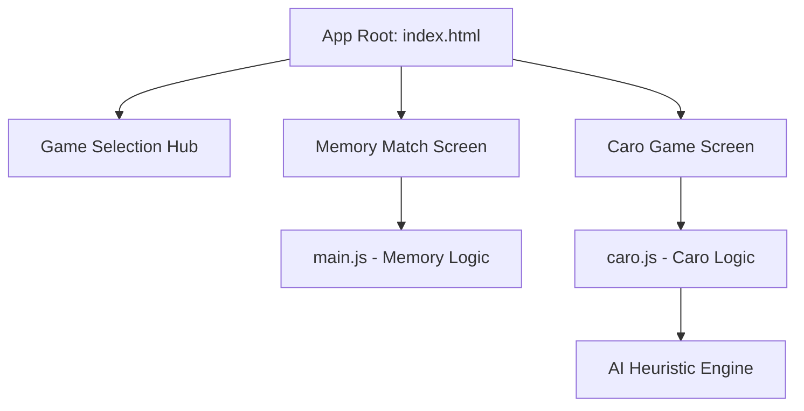

# Architect Plan: Adding Caro Game (Gomoku) to Mini-Game Web App

This document outlines the architectural plan to add a new Caro (Gomoku) game to the existing web application. The application will be refactored into a **Multi-Game Hub**, allowing users to seamlessly choose between the existing "Memory Match" game and the new "Caro" game.

## 1. Architectural Goals
- **Multi-Game Navigation (Hub)**: Convert the interface into a game selection dashboard (Hub) with a premium, glassmorphic layout.
- **Caro Game Features**:
  - **Modes**: Player vs Player (Local) and Player vs AI (PvE).
  - **AI Engine**: A smart heuristic evaluation-based AI that defends and attacks effectively (no simple random moves).
  - **Rules**: Implement 5-in-a-row winning condition with the standard Vietnamese Caro rule (cannot win if blocked at both ends).
  - **Board Size**: Flexible board sizes (default 12x12 or 15x15) optimized for both desktop and mobile layouts.
  - **Visuals**: Modern neon indicators, hover preview of coordinates/pieces, and glowing highlight animations for winning lines.
- **Aesthetics & Code Quality**: Maintain a unified premium dark theme with smooth CSS transitions, avoiding page reloads.

---

## 2. Component Design & Changes

### 2.1 UI/UX Updates (`index.html` & `style.css`)
- **Game Hub Dashboard**: 
  - Add a primary selection screen with interactive, glowing cards for "Memory Match" and "Caro Game".
  - Utilize beautiful linear gradients, hover scaling, and glassmorphic card stylings.
- **Caro Screen Layout**:
  - **Header**: Title, score tracker (X Wins / O Wins / Ties), turn indicator.
  - **Game Config Settings**: Buttons to select "PvP / PvE" mode, select "Board Size" (10x10 / 12x12 / 15x15), and a "Restart" button.
  - **Caro Board Area**: A dynamic responsive grid layout that handles auto-sizing of cells to prevent overflow on mobile.
- **Styling Tokens**:
  - Add specialized variables for Caro: `--caro-x-color` (e.g., #fb7185 - soft rose red) and `--caro-o-color` (e.g., #38bdf8 - neon sky blue).
  - Grid cell lines will use thin, semi-transparent borders with a glow effect on hover.

### 2.2 Game Logic (`caro.js`)
We will create a separate JavaScript file `caro.js` to keep the codebase clean.
- **State Properties**:
  - `board`: 2D array representation of the board state (`null`, `'X'`, or `'O'`).
  - `currentPlayer`: `'X'` or `'O'`.
  - `gameMode`: `'pvp'` or `'pve'`.
  - `boardSize`: `12` (default, perfect balance for mobile/desktop).
  - `gameActive`: Boolean flag.
- **Win Checker**:
  - Scans four directions (horizontal, vertical, diagonal-up, diagonal-down) from the last placed piece.
  - Count consecutive matching pieces.
  - If exactly 5 (or more) are aligned, check if both ends are blocked by opponent pieces:
    - If blocked on both ends: Not a win.
    - Otherwise: Declare winner, highlight cells, and end game.
- **AI Implementation (Heuristic Evaluation)**:
  - We will implement a scoring engine that evaluates every empty cell on the board.
  - For each empty cell, calculate a score based on continuous chains of X and O it can form or block.
  - Scoring weight guidelines (for O as AI and X as Player):
    - **Winning/Attacking Chains**: Give extremely high weight to forming 5-in-a-row (immediate win), 4-in-a-row (open or blocked 1 end), and 3-in-a-row.
    - **Defending/Blocking Chains**: Give high weights to blocking the player's 4-in-a-row (immediate danger) and 3-in-a-row.
  - The AI selects the cell with the maximum score (combination of attack score + defense score).

---

## 3. Detailed Step-by-Step Task List

### Phase 1: Hub Structure & Page Layout
- [ ] **Step 1.1**: Update [index.html](file:///D:/workspace/wt-bf5abd5396b34b43aae44140819906de/index.html) to incorporate the Game Selector Hub and wrap the Memory Match game inside a separate screen container. Add the Caro Game screen container structure (board grid, mode selector, scores).
- [ ] **Step 1.2**: Update [style.css](file:///D:/workspace/wt-bf5abd5396b34b43aae44140819906de/style.css) to support multi-screen navigation (e.g., `.screen { display: none; }` & `.screen.active { display: block/flex; }`), styled Caro board grid, glowing X/O pieces, and modern action buttons.

### Phase 2: Navigation & Caro Core Logic
- [ ] **Step 2.1**: Implement screen navigation in [main.js](file:///D:/workspace/wt-bf5abd5396b34b43aae44140819906de/main.js) (handling clicks from Hub cards back and forth).
- [ ] **Step 2.2**: Create a new file `caro.js` in the workspace root. Define basic game state, board rendering, local PvP turn taking, and visual placement of X and O pieces.

### Phase 3: Win Checker & AI Engine
- [ ] **Step 3.1**: Write the 5-in-a-row win detection algorithm with double-end block rules (Vietnamese Caro standard) in `caro.js`. Add winning line glowing highlight animations.
- [ ] **Step 3.2**: Develop the heuristic-based AI algorithm in `caro.js`. Include scoring parameters for attacking and defensive layouts to provide a challenging opponent.

### Phase 4: UI Refinement, Responsive Tuning & Testing
- [ ] **Step 4.1**: Fine-tune responsive designs for Caro board sizes on small devices (e.g., scale cell size dynamically, add a scrollable/pan area if needed, or adjust font-size based on board dimensions).
- [ ] **Step 4.2**: Verify features: test all modes (PvP, PvE), win checking scenarios (horizontal, vertical, diagonal, blocked ends), restart/reset actions, and score caching.
- [ ] **Step 4.3**: Create/update `memory.md` to document the new project structure and features.
