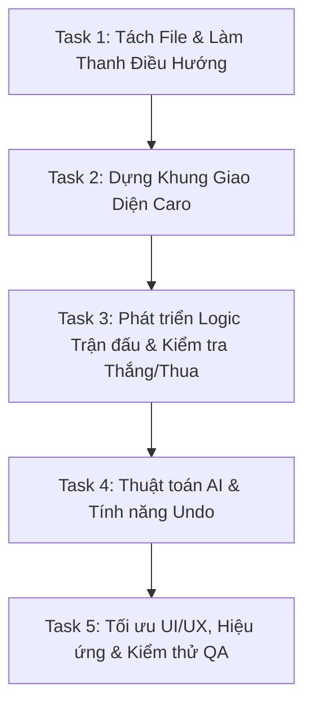

# Kế hoạch Kỹ thuật: Tích hợp Game Cờ Ca Rô (Gomoku) vào Web

Bản kế hoạch này mô tả chi tiết phương án và thiết kế kỹ thuật để bổ sung trò chơi **Cờ Ca Rô (Gomoku)** vào ứng dụng web game hiện có (hiện tại chỉ có game Memory Match).

---

## 1. Mục tiêu & Phạm vi

### Mục tiêu
*   Tích hợp game Cờ Ca Rô (Gomoku) trực tiếp vào ứng dụng web tĩnh hiện tại.
*   Cải tiến giao diện người dùng (UI) thành giao diện đa game (Multi-game Lobby) với thiết kế hiện đại, cao cấp (glassmorphism, gradient, hiệu ứng phát sáng neon).
*   Đảm bảo trò chơi chạy mượt mà, phản hồi ngay lập tức trên cả máy tính (Desktop) và điện thoại di động (Mobile).

### Phạm vi chức năng của Game Cờ Ca Rô:
*   **Bàn cờ kích thước 12x12**: Kích thước lý tưởng đảm bảo tính chiến thuật của Caro và hiển thị vừa vặn trên màn hình di động mà không cần cuộn trang.
*   **Hai chế độ chơi (Game Modes)**:
    1.  *Player vs Player (PvP)*: Hai người chơi thay phiên đi quân trên cùng một thiết bị.
    2.  *Player vs Bot (PvE)*: Người chơi (X) đấu với Máy tính/Bot (O) sử dụng thuật toán heuristic thông minh.
*   **Luật chơi**: Gomoku chuẩn — người chơi đầu tiên có đúng hoặc nhiều hơn 5 quân cờ liên tục theo hàng ngang, hàng dọc hoặc đường chéo sẽ chiến thắng.
*   **Tính năng bổ trợ**:
    *   *Undo*: Quay lại nước đi trước đó (đặc biệt hữu ích khi chơi với Bot).
    *   *Bảng điểm (Scoreboard)*: Theo dõi số trận thắng của X, O và số trận Hòa.
    *   *Bộ đếm thời gian (Timer)*: Tính thời gian của ván đấu hiện tại.
    *   *Hiệu ứng hình ảnh*: Highlight 5 quân cờ chiến thắng, hiệu ứng rê chuột (hover preview) quân cờ mờ.

---

## 2. Phương án Thiết kế

### Đánh giá các phương án tích hợp:

| Phương án | Ưu điểm | Nhược điểm | Đánh giá |
| :--- | :--- | :--- | :--- |
| **Phương án 1**: Ghép chung toàn bộ logic Caro vào file `main.js` hiện tại. | Không cần đổi cấu trúc tải file, đơn giản. | File `main.js` sẽ cực kỳ lớn (>500 dòng), khó quản lý, dễ xảy ra lỗi xung đột biến toàn cục. | **LOẠI** |
| **Phương án 2**: Tái cấu trúc bằng ES Modules (`type="module"`). | Code sạch sẽ, chia module rõ ràng. | Bị giới hạn bởi lỗi CORS nếu người dùng mở trực tiếp file `index.html` từ trình duyệt (giao thức `file://`) không qua web server. | **LOẠI** (do cần đảm bảo ứng dụng chạy tốt trong mọi môi trường). |
| **Phương án 3 (Khuyến nghị)**: Tách file JS theo cơ chế Namespace. | Rõ ràng, dễ debug, tránh xung đột biến, chạy tốt cả trên web server lẫn chạy trực tiếp bằng file offline (`file://`). | Cần khai báo đúng thứ tự tải file trong `index.html`. | **CHỌN** |

### Giải pháp kỹ thuật lựa chọn (Phương án 3):
1.  **`index.html`**: Đóng vai trò layout tổng và khai báo các script theo thứ tự:
    *   `js/memory.js` (Chứa logic game Memory Match cũ)
    *   `js/caro.js` (Chứa logic game Caro mới)
    *   `main.js` (Đóng vai trò điều phối chuyển tab game và khởi tạo)
2.  **Chuyển đổi giao diện**: Thiết kế thanh điều hướng (Navigation Bar) dạng Tab ở trên cùng để người dùng chuyển qua lại giữa các game. Trạng thái game không hoạt động sẽ được ẩn đi bằng CSS (`display: none`) và được dọn dẹp bộ nhớ (cleared intervals).

---

## 3. Thiết kế Kỹ thuật Chi tiết

### 3.1. Cấu trúc Thư mục Dự kiến
```text
workspace/
├── index.html        # Layout & Khung HTML cho cả 2 game
├── style.css         # CSS styles tổng hợp (Lobby, Memory, Caro)
├── main.js           # Bộ điều phối chuyển game (Lobby Controller)
└── js/
    ├── memory.js     # Logic game Memory Match (tách từ main.js cũ)
    └── caro.js       # Logic game Cờ Ca Rô mới
```

### 3.2. Sơ đồ Giao diện & Trải nghiệm (UI/UX)
*   **Thanh điều hướng**: Đặt phía trên tiêu đề, bo góc tròn, nền mờ kính (glassmorphism) với đường viền mỏng màu trắng mờ. Khi click vào Tab, sẽ có hiệu ứng trượt hoặc đổi màu gradient rực rỡ để báo trạng thái Active.
*   **Quân cờ Caro**:
    *   **Quân X**: Phát sáng màu hồng cánh sen (`#fb7185`), vẽ bằng nét chéo neon nổi bật.
    *   **Quân O**: Phát sáng màu xanh ngọc (`#06b6d4`), vẽ bằng hình tròn neon sắc nét.
*   **Bàn cờ Caro**:
    *   Nền tối mờ nhẹ tương thích với giao diện chung của trang web.
    *   Các ô cờ có kích thước tương đồng (khoảng 35px - 45px tùy màn hình), phân cách bằng các đường viền nét mỏng nhẹ (`rgba(255,255,255,0.06)`).
    *   Hiệu ứng Hover: Khi người chơi rê chuột vào ô trống, hiển thị trước quân cờ của lượt hiện tại với độ trong suốt 30% để người chơi dễ định vị.

### 3.3. Thiết kế Logic Caro (`js/caro.js`)

#### Biến trạng thái (State):
```javascript
const CaroState = {
    board: [],         // Mảng 2 chiều 12x12 lưu trạng thái từng ô: null, 'X', 'O'
    currentPlayer: 'X',// Lượt đi hiện tại: 'X' hoặc 'O'
    gameMode: 'bot',   // Chế độ chơi: 'pvp' hoặc 'bot'
    isGameOver: false,
    history: [],       // Mảng lưu lịch sử các nước đi phục vụ tính năng Undo
    scores: { X: 0, O: 0, Draws: 0 },
    timer: null,
    seconds: 0
};
```

#### Thuật toán Kiểm tra Thắng (Win Checker):
Từ ô cờ mới đánh `(r, c)`, kiểm tra trong 4 hướng (Ngang, Dọc, Chéo xuôi, Chéo ngược). Trong mỗi hướng, đếm số quân liên tiếp cùng loại của người chơi hiện tại về cả 2 phía. Nếu tổng số quân $\ge 5$, người đó thắng. Trả về mảng tọa độ 5 ô chiến thắng để tô màu highlight.

#### Thuật toán AI (Bot Mode - Heuristic):
Để đảm bảo tốc độ phản hồi tức thì (<2ms) trên mọi thiết bị mà không gây đơ trình duyệt:
1.  **Duyệt toàn bộ các ô trống** trên bàn cờ.
2.  Với mỗi ô trống, tính điểm ưu tiên dựa trên:
    *   **Điểm Tấn công (Attack Score)**: Đếm số quân 'O' liên tiếp trong 4 hướng nếu Bot đi vào ô này.
    *   **Điểm Phòng thủ (Defense Score)**: Đếm số quân 'X' liên tiếp trong 4 hướng nếu Player đi vào ô này (dùng để chặn đối thủ).
3.  **Hệ số chấm điểm**:
    *   Có 4 quân liên tiếp (sắp thành 5): Ưu tiên cực cao (Thắng luôn hoặc Chặn đứng đối thủ thắng).
    *   Có 3 quân liên tiếp và 2 đầu thoáng: Ưu tiên cao.
    *   Các thế cờ 2 quân hoặc 1 quân: Điểm thấp dần.
4.  Bot chọn ô có **Tổng Điểm (Tấn công + Phòng thủ) cao nhất** để đặt quân.

---

## 4. Hạng mục Công việc (Task List)

Dưới đây là danh sách các task được sắp xếp theo thứ tự triển khai, đảm bảo tính độc lập và dễ kiểm thử:



### Chi tiết các Task:

#### **Task 1: Tách File & Tạo Thanh Điều Hướng (Lobby)**
*   **Mô tả**: Tách logic Memory Match hiện tại từ `main.js` sang file mới `js/memory.js`. Tạo cấu trúc Namespace `window.MemoryGame`. Tạo thanh điều hướng Tab ở phía trên `index.html` và viết CSS hiệu ứng chuyển tab.
*   **File ảnh hưởng**: `index.html`, `style.css`, `main.js`, `js/memory.js` (tạo mới).
*   **Cách kiểm thử**: Bấm chuyển đổi giữa Tab Memory Match và Tab Caro. Đảm bảo game Memory Match cũ vẫn chơi bình thường, không có lỗi JS trong Console.

#### **Task 2: Dựng Khung Giao Diện Caro**
*   **Mô tả**: Viết HTML/CSS để dựng bàn cờ Caro 12x12, thanh thông tin (Lượt đi, Chế độ chơi, Bảng điểm, Timer). Thiết kế quân cờ X và O với hiệu ứng phát sáng neon sang trọng.
*   **File ảnh hưởng**: `index.html`, `style.css`, `js/caro.js` (tạo mới).
*   **Cách kiểm thử**: Bàn cờ Caro hiển thị đẹp mắt, tự co giãn theo kích thước màn hình. Các ô cờ có viền mờ tinh tế.

#### **Task 3: Phát triển Logic Trận đấu & Kiểm tra Thắng/Thua**
*   **Mô tả**: Lập trình logic đặt quân luân phiên giữa X và O (chế độ PvP). Xây dựng hàm kiểm tra thắng cuộc 5 ô liên tiếp và hòa cờ khi hết ô trống. Thêm hiệu ứng highlight khi có người thắng cuộc.
*   **File ảnh hưởng**: `js/caro.js`.
*   **Cách kiểm thử**: Chơi thử ở chế độ PvP, đánh đủ 5 quân cùng hàng (ngang/dọc/chéo) xem game có dừng lại, tô màu xanh lá cây cho các quân thắng và hiển thị modal chiến thắng hay không.

#### **Task 4: Thuật toán AI (Bot Mode) & Tính năng Undo**
*   **Mô tả**: Triển khai thuật toán chấm điểm Heuristic cho Bot. Tích hợp nút bật/tắt chế độ PvP vs PvE. Xây dựng cơ chế Undo (lùi lại 1 nước ở PvP, lùi lại 2 nước ở PvE để bỏ qua lượt của Bot).
*   **File ảnh hưởng**: `js/caro.js`, `index.html`.
*   **Cách kiểm thử**: Chọn chế độ đấu với Bot, đánh quân X và quan sát Bot tự động đánh quân O để cản phá hoặc tấn công. Thử bấm Undo sau một vài nước đi để xác nhận bàn cờ quay lại đúng trạng thái trước đó.

#### **Task 5: Tối ưu UI/UX, Hiệu ứng & Kiểm thử QA**
*   **Mô tả**: Thêm các micro-animations (hiệu ứng hover hiện quân cờ mờ, hiệu ứng rung lắc nhẹ khi đặt quân, âm thanh click nhẹ nếu cần). Đảm bảo dọn dẹp các Timer khi chuyển tab game để không bị rò rỉ hiệu năng.
*   **File ảnh hưởng**: `style.css`, `main.js`, `js/caro.js`.
*   **Cách kiểm thử**: Kiểm tra độ mượt trên thiết bị di động giả lập. Test các trường hợp biên như spam click, đổi chế độ chơi liên tục khi đang trận, Undo về ván trống.

---

## 5. Rủi ro & Cách Giảm thiểu

1.  **Rủi ro 1: Vấn đề hiển thị Bàn cờ 12x12 trên màn hình điện thoại nhỏ (dưới 360px)**
    *   *Mô tả*: Ô cờ quá nhỏ khiến người dùng khó chạm ngón tay chính xác vào ô mình muốn đi.
    *   *Giảm thiểu*: Sử dụng thuộc tính `touch-action: manipulation` để tắt delay double-tap trên mobile. Đồng thời kích thước ô cờ tối thiểu sẽ là `30px`, bàn cờ có thể tự động cho phép cuộn ngang nhẹ (`overflow-x: auto`) nếu màn hình quá bé để đảm bảo trải nghiệm bấm chính xác.
2.  **Rủi ro 2: AI Bot tính toán chậm gây đứng luồng giao diện**
    *   *Mô tả*: Việc lặp qua $12 \times 12 = 144$ ô trống và tính điểm 4 hướng có thể tốn tài nguyên nếu thuật toán duyệt đệ quy (Minimax).
    *   *Giảm thiểu*: Tránh dùng Minimax đệ quy sâu. Sử dụng Heuristic tĩnh một tầng (One-ply Heuristic Search). Bot chỉ duyệt qua các ô trống kề cận các ô đã đánh trong bán kính 2 ô (không duyệt toàn bộ bàn cờ nếu bàn cờ còn trống nhiều), tối ưu hóa số lượng phép tính xuống mức cực kỳ nhỏ (<50 ô cần tính).
3.  **Rủi ro 3: Xung đột bộ đếm thời gian (Timer Interval)**
    *   *Mô tả*: Timer của game Memory Match và game Caro chạy song song làm sai lệch thời gian hoặc gây quá tải tài nguyên.
    *   *Giảm thiểu*: Viết hàm `stop()` rõ ràng cho mỗi game. Khi chuyển tab, hàm chuyển đổi trong `main.js` sẽ gọi phương thức dừng timer của game cũ trước khi khởi động game mới.

---

## 6. Cách Xác nhận Hoàn thành (E2E Verification)

*   **Chuyển đổi game**: Click qua lại các tab game, không bị giật lag, màn hình tương ứng hiện lên chính xác.
*   **Ván đấu Caro kết thúc chuẩn**: Đánh thắng hiển thị modal chúc mừng đúng tên người thắng (Player X / Player O / Bot). Bảng điểm cộng thêm 1 điểm cho bên thắng.
*   **Bot hoạt động thông minh**: Bot biết chặn hàng 3, hàng 4 của người chơi và biết tự tạo hàng 4, hàng 5 để giành chiến thắng.
*   **Undo chính xác**: Bấm Undo quay lại nước trước đó hoàn hảo, không làm sai lệch vị trí quân cờ và lượt đi hiện tại.
*   **Khởi động lại**: Bấm Restart game thiết lập lại bàn cờ trống, bộ đếm thời gian về `0:00`, lượt đi về người chơi X.
